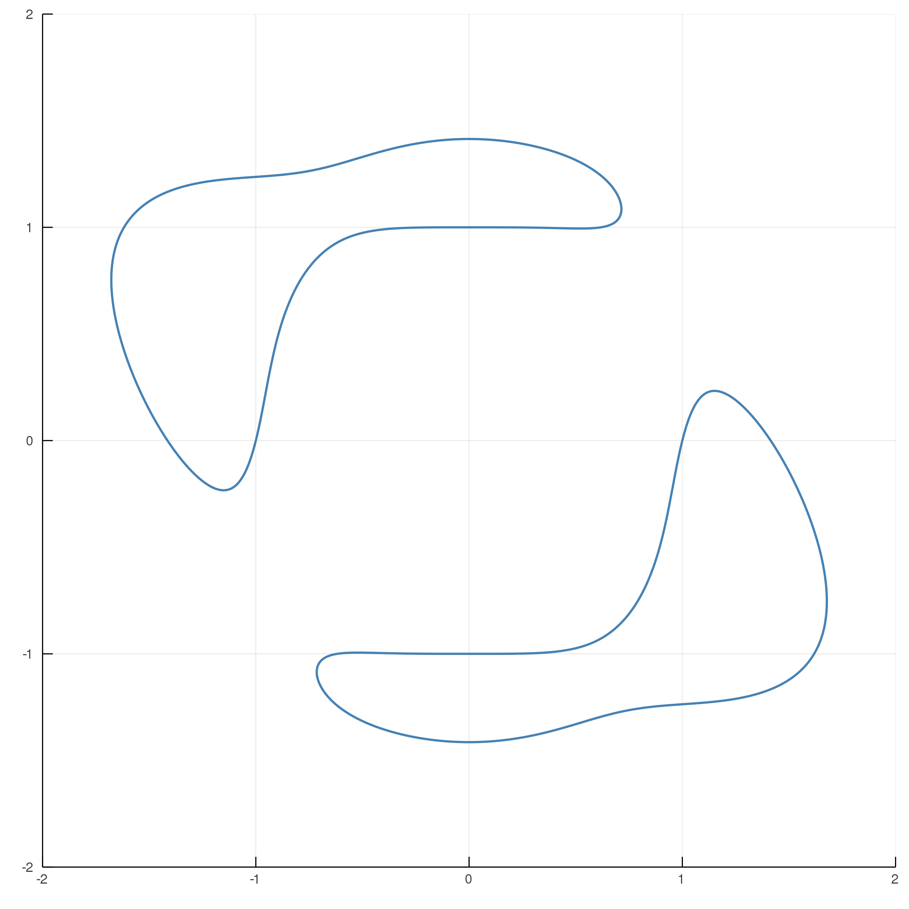

# ImplicitPlots.jl

Plot plane curve defined by an implicit function `f(x,y)=0`.

## Plane curves

```julia
using ImplicitPlots, Plots

f(x,y) = (x^4 + y^4 - 1) * (x^2 + y^2 - 2) + x^5 * y
implicit_plot(f; xlims=(-2,2), ylims=(-2,2))
```
</img>

Polynomials following the `MultivariatePolynomials.jl` interface, e.g., `DynamicPolynomials.jl`
are also supported.
```julia
using DynamicPolynomials, Plots
@polyvar x y
f2 = (x^4 + y^4 - 1) * (x^2 + y^2 - 2) + x^5 * y
implicit_plot(f2; xlims=(-2,2), ylims=(-2,2))
```
